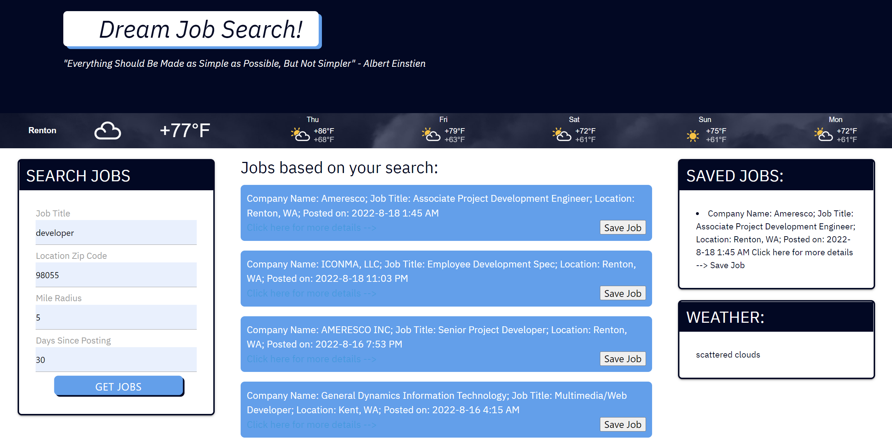

# dream-job-finder
This project presented is a simple job search engine.

When the user enters a Job title, city or zip, mile radius, and days posted a list of the most recent 25 job will populate.

More often than not when searching for a job, postings are rarely updated or deleted. Therefore our goal was to find the most recent postings available.

Upon searching through the listings there are some simple features added such as an external link and a save button to your local storage.

If the external link is clicked the user will be brought to a new page where the job listing is originally posted vs the use of a 3rd party interface.

From there the user can apply and then return to our search engine to find the next best fitting opportunity.

To add some appeal there is also a weather widget which contains a 5 day forcast and automatically detects the users location.

## User Story

```
AS A person seeking employment
I WANT to see the the most recent job postings relevant to a job title search
SO THAT I can apply to the job and saved the postings that I find fitting.
```

